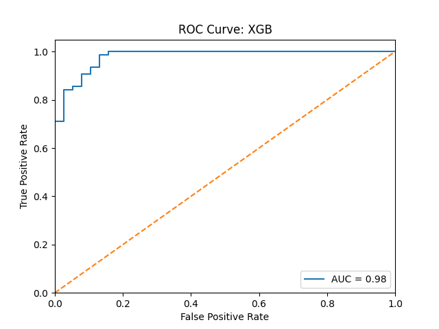

# RL-Connect4

This repository includes several variants of reinforcement learning immplementations
using pyTorch to play the game of Connect4.

## Quick Notes on Setting Up

You should be using virtual environment.

You'll need pyTorch and other common ML libraries (numpy, matplotlib, etc).

You should also set up `PYTHONPATH` to include the root directory of this repo:

```
> export PYTHONPATH={YOUR_PATH}:$PYTHONPATH
```

You can save this as a bash script and source it every time you start a new terminal:

```
> source init.sh
```

## PyTorch 101

First we gain some familiarity with [PyTorch](https://pytorch.org/) by
implementing a simple neural network to classify a sample dataset from
[scikit-learn](https://scikit-learn.org/stable/index.html).

In the [pytorch101](pytorch101) directory, there is `xgboost.py` and `nnet.py`.
The former uses the [XGBoost](https://xgboost.readthedocs.io/en/stable/#) library
to make a classifier. The latter uses PyTorch to implement a neural network.

```
> python xgb.py
> python nnet.py
```




## Visualization

We use python's [curses](https://docs.python.org/3/howto/curses.html) to make the
game playable in the terminal.

https://github.com/jovisly/RL-Connect4/assets/99686932/31859b85-a813-491c-9d30-e6e535a1ccf0

## Tabular Q-Learning

The "fun" thing about Connect 4 is that its state space is
3 ^ 42 = 109,418,989,131,512,359,209 (each grid can be occupied by player 1, 2,
or empty, and there are 42 grids). So we can't just train a Q lookup table.
Therefore we will use a neural network to approximate the Q table.

## DQN

The DQN (Deep Q-Network) algorithm uses a neural network to approximate the Q
table:

```
state --> neural network --> Q values --> action
```

After each (state, action) pair, we compute TD target and TD error, then update
the neural network weights using gradient descent.

We need to train the model with an opponent. The opponent should be good enough
that the model can learn by playing with it, but not the full policy to end up
with a model that's only good when it plays against itself. So we let the opponent
use the model but at a lower chance.

The model can be trained with

```
> cd learners
> python learner_dqn.py
```
